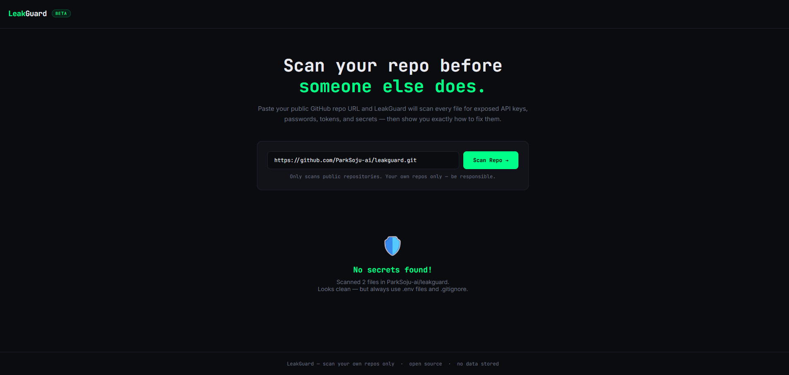

# 🛡️ LeakGuard

**Scan your own GitHub repo for exposed secrets before someone else finds them.**

LeakGuard is a free, open-source browser tool that scans public GitHub repositories for accidentally committed API keys, passwords, tokens, and other secrets — then tells you exactly where they are and how to fix them.

> ⚠️ **For scanning your own repositories only. Use responsibly.**

---

## 🚀 Live Demo

👉 **[Try it now → ParkSoju-ai.github.io/leakguard](https://ParkSoju-ai.github.io/leakguard)**

---

## 📸 Screenshot

<!-- Add a screenshot of the tool here after deploying -->
<!--  -->

---

## 🔍 What It Detects

| Secret Type | Severity |
|---|---|
| OpenAI / Anthropic API Keys | 🔴 Critical |
| AWS Access & Secret Keys | 🔴 Critical |
| Google API Keys | 🔴 Critical |
| GitHub Tokens | 🔴 Critical |
| Stripe Live Keys | 🔴 Critical |
| Telegram Bot Tokens | 🔴 Critical |
| Slack Tokens | 🔴 Critical |
| Hardcoded Passwords | 🔴 Critical |
| Database Connection Strings | 🔴 Critical |
| Private Key Blocks (RSA/EC) | 🔴 Critical |
| JWT Secrets | 🔴 Critical |
| Cloudflare API Tokens | 🔴 Critical |
| Shopee / Lazada Affiliate Tokens | 🔴 Critical |
| Stripe Test Keys | 🟡 Warning |
| Firebase Config Keys | 🟡 Warning |
| Generic Secrets & API Keys | 🟡 Warning |
| `.env` file committed | 🟡 Warning |

---

## ✨ Features

- ✅ **100% browser-based** — no server, no backend, no data stored
- ✅ **No login required** — works with any public GitHub repo
- ✅ **20+ secret patterns** detected
- ✅ **Shows exact file + line number** of each issue
- ✅ **Tells you how to fix** every finding
- ✅ **Scans up to 80 files** per repo via GitHub's free public API
- ✅ **Prioritizes sensitive files** like `.env`, `config.js`, `secrets.js`

---

## 🛠️ How to Use

1. Go to **[ParkSoju-ai.github.io/leakguard](https://ParkSoju-ai.github.io/leakguard)**
2. Paste your GitHub repo URL (e.g. `https://github.com/yourname/yourrepo`)
3. Click **Scan Repo →**
4. Review findings and follow the fix instructions

That's it — no install, no sign up, no tracking.

---

## 🖥️ Run Locally

Just download and open:

```bash
git clone https://github.com/ParkSoju-ai/leakguard.git
cd leakguard
# Open index.html in your browser
```

No dependencies. No build step. Pure HTML/CSS/JS.

---

## 🔒 Privacy

- LeakGuard runs **entirely in your browser**
- It only reads **publicly accessible files** via GitHub's API
- It does **not store, log, or transmit** any data
- No cookies, no analytics, no tracking

---

## ⚠️ Responsible Use

LeakGuard is built for developers to audit **their own repositories** before publishing. Using this tool to scan repositories you do not own may violate GitHub's Terms of Service and local laws.

**Scan your own repos. Be responsible.**

---

## 🤝 Contributing

Found a new secret pattern to detect? PRs are welcome!

1. Fork the repo
2. Add your pattern to the `PATTERNS` array in `index.html`
3. Submit a pull request

---

## 💛 Support This Project

If LeakGuard saved your API key from being stolen, consider supporting:

[](https://github.com/sponsors/ParkSoju-ai)

---

## 📄 License

MIT License — free to use, modify, and distribute.

---

*Built with ❤️ by [@ParkSoju-ai](https://github.com/ParkSoju-ai)*
